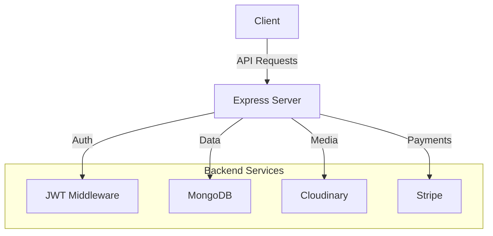

# Learning Management System (LMS)

A robust Learning Management System built with MERN stack that enables instructors to create courses and students to enroll and track their progress.

## 🚀 Features

- User Authentication & Authorization
- Course Management
- Video Lecture Hosting
- Payment Integration with Stripe
- Progress Tracking
- Search & Filter Courses
- Profile Management

## 🏗️ System Architecture



## 💾 Data Models

### User Schema
| Field | Type | Required | Default | Description |
|-------|------|----------|---------|-------------|
| name | String | Yes | - | User's name |
| email | String | Yes | - | User's email |
| password | String | Yes | - | Encrypted password |
| role | String | No | 'student' | User role (student/instructor) |
| enrolledCourses | [ObjectId] | No | [] | References to enrolled courses |
| photoUrl | String | No | "" | Profile photo URL |

### Course Schema
| Field | Type | Required | Default | Description |
|-------|------|----------|---------|-------------|
| courseTitle | String | Yes | - | Title of the course |
| category | String | Yes | - | Course category |
| courseLevel | String | No | - | Beginner/Medium/Advance |
| coursePrice | Number | No | - | Price in INR |
| isPublished | Boolean | No | false | Publication status |
| creator | ObjectId | Yes | - | Reference to instructor |

## 🛣️ API Routes

### Authentication
```
POST   /api/v1/user/register          # Register new user
POST   /api/v1/user/login             # Login
GET    /api/v1/user/logout            # Logout
GET    /api/v1/user/profile           # Get profile
PUT    /api/v1/user/profile/update    # Update profile
```

### Courses
```
POST   /api/v1/course                 # Create course
GET    /api/v1/course/search          # Search courses
GET    /api/v1/course/:courseId       # Get course details
PUT    /api/v1/course/:courseId       # Update course
PATCH  /api/v1/course/:courseId       # Toggle publish status
```

### Course Progress
```
GET    /api/v1/progress/:courseId     # Get progress
POST   /api/v1/progress/:courseId/lecture/:lectureId/view  # Mark lecture viewed
POST   /api/v1/progress/:courseId/complete    # Mark course complete
```

### Purchases
```
POST   /api/v1/purchase/checkout/create-checkout-session  # Create payment session
GET    /api/v1/purchase/course/:courseId/detail-with-status  # Get purchase status
```

## 🛠️ Tech Stack

- **Frontend**: React.js, Redux Toolkit
- **Backend**: Node.js, Express.js
- **Database**: MongoDB
- **File Storage**: Cloudinary
- **Payment**: Stripe
- **Authentication**: JWT

## ⚙️ Environment Variables

```env
PORT=8080
MONGODB_URI=your_mongodb_connection_string
SECRET_KEY=your_jwt_secret_key
STRIPE_SECRET_KEY=your_stripe_key
CLOUDINARY_NAME=your_cloudinary_name
CLOUDINARY_API_KEY=your_cloudinary_key
CLOUDINARY_API_SECRET=your_cloudinary_secret
```

## 🚀 Getting Started

1. **Clone the repository**
```bash
git clone https://github.com/yourusername/lms.git
cd lms
```

2. **Install dependencies**
```bash
# Install server dependencies
cd server
npm install

# Install client dependencies
cd ../client
npm install
```

3. **Set up environment variables**
- Create `.env` file in server directory
- Add required environment variables

4. **Run the application**
```bash
# Run server (from server directory)
npm start

# Run client (from client directory)
npm run dev
```

## 🔒 Authentication Flow

1. User registers/logs in
2. Server validates credentials
3. JWT token generated and stored in cookie
4. Token verified through middleware for protected routes

## 🛒 Purchase Flow

1. User initiates course purchase
2. Stripe checkout session created
3. User completes payment
4. Webhook confirms payment
5. Course access granted to user

## 📝 License

This project is licensed under the GITS:- Created BY Praful Mali